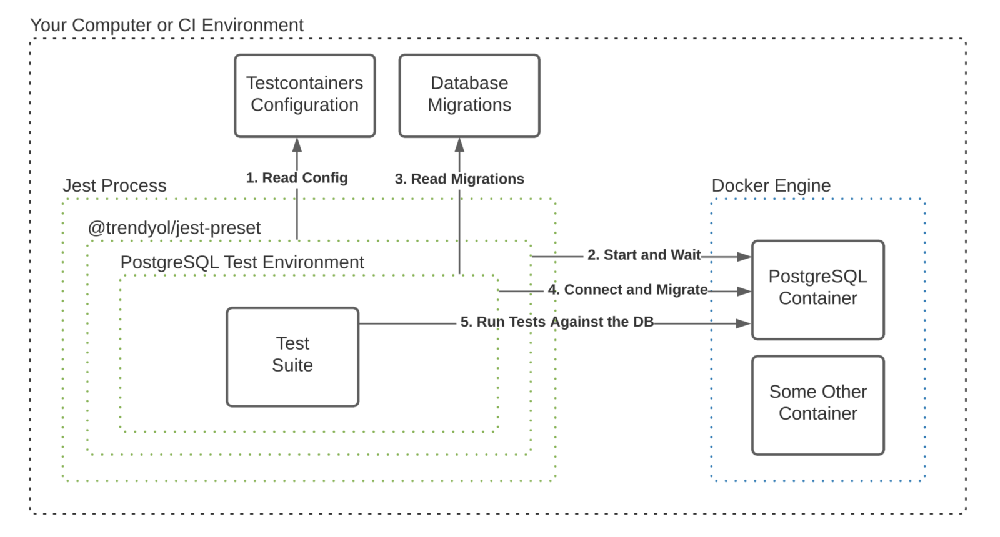

# nodejs-postgresql-testcontainers
An example project showcasing how to use [@trendyol/jest-testcontainers](https://github.com/Trendyol/jest-testcontainers) to write integration tests for your PostgreSQL queries.

Read the article describing this project in detail [on Medium](https://medium.com/trendyol-tech/how-to-test-database-queries-and-more-with-node-js-2f02b08707a7).

### Project Structure
```
.
├── migrations        # database migratioons
├── src               # source code of your application
└── test
    ├── integration   # integration tests that contain IO operations(e.g. DB, Queue)
    └── unit          # unit tests for pure business logic / interaction witout IO
```

### Overview


1. [test/integration/](test/integration) includes various files like [jest.config.js](test/integration/jest.config.js), [jest-testcontainers-config.js](test/integration/jest-testcontainers-config.js) and [preset.js](test/integration/preset.js) for configuring jest-testcontainers to start a PostgreSQL instance. 
2. [jest-testcontainers](https://github.com/Trendyol/jest-testcontainers) is used to start a PostgreSQL instance and wait for t to start.
3. [migrations/](migrations) folder stores database schema migrations that will be applied to the started PostgreSQL instance.
4. [postgresql.environment.ts](test/integration/postgresql.environment.ts) uses [node-pg-migrate](https://github.com/salsita/node-pg-migrate) to migrate PostgreSQL instance started by the jest-testcontainers.
5. [test/integration/](test/integration) folder is scanned for files with `*.test.ts` prefix and tests are ran.

Watch mode is supported so you can start your integration tests in watch mode and refactor your code whilst your PostgreSQL Docker instance is up.

